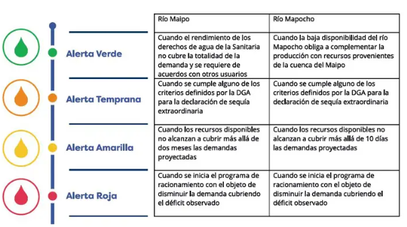

<!-- PROJECT LOGO -->
<a href="https://github.com/grojasc/image">
    
</a>


# MIA_DS_project: GRUPO 8
Proyecto 2022-1 MIA UC, Intro Data Science

## Links importantes

+ Documento Entrega 1 :arrow_right: [link](https://docs.google.com/document/d/1iX4fWpx_Ve2AxUk_cVHWpNWbe2lXNLpwhVjJG1Vsx94/edit?pli=1)
+ Super Servicios Sanitarios:arrow_right: [link]( www.siss.gob.cl)
+ Drive Grupo 8:arrow_right: [link](https://drive.google.com/drive/u/0/folders/1rM6gkgPJj0QzSdJE5wqqjWYgZrwgCO_a)
+ Aguas Andinas reportes :arrow_right: [link](https://sustentabilidad.aguasandinas.cl/documents/33547/35846/Reporte+Integrado+Aguas+Andinas+2019.pdf/cd2cdfeb-5338-66ae-7bd0-8cb06a0f20ca?t=1590688082827)
+ Miro colaborativo ➡️ [link](https://miro.com/app/board/uXjVO0YbVvA=/)


## Árbol del repositorio.

```
.
├── Código
│   ├── Caudales_rio_maipo.py
│   │   ├──
│   │   └── 
│   ├── Caudales_rio_maipo.py
│   │   ├──
│   │   └── 
│   │
│   └── Proyecto final.ipynb
│       ├──
│       └── 
├── Data Procesada
│   ├── Regiones.csv Fuente : (https://www.ine.cl/estadisticas/sociales/demografia-y-vitales/proyecciones-de-poblacion)
│   ├── caudales_2018-2021.csv
│   └── Comunas.csv Fuente : (https://www.ine.cl/estadisticas/sociales/demografia-y-vitales/proyecciones-de-poblacion)
├── Data
│   ├── Datos de consumo (Articles-16585.xlsx) Fuente: (http://www.siss.gob.cl/appsiss/historico/w3-propertyvalue-6377.html)
│   ├── Poblacion_region.csv Fuente: (https://www.ine.cl/estadisticas/sociales/demografia-y-vitales/proyecciones-de-poblacion)
│   ├── cr2_qflxDaily_2018_stations Fuente: (https://www.cr2.cl/datos-de-caudales/)
│   ├── cr2_qflxDaily_2018_description Fuente: (https://www.cr2.cl/datos-de-caudales/)
│   ├── cr2_qflxDaily_2018.txt Fuente: (https://www.cr2.cl/datos-de-caudales/)
│   ├── Glaciares.shp  Fuente:  http://www.geoportal.cl/geoportal/catalog/search/resource/resumen.page?uuid={99BCC048-47F7-4FD0-8C6D-FB9DDB66A789}
│   ├── caudales_rio_maipo.csv Fuente: (https://www.ine.cl/estadisticas/sociales/demografia-y-vitales/proyecciones-de-poblacion)
│   ├── Crecimiento PIB % Mundial.xlsx Fuente : (https://datos.bancomundial.org/indicator/NY.GDP.MKTP.KD.ZG)
│   ├── Crecimiento_población_mundial.xlsx Fuente : (https://datos.bancomundial.org/indicator/SP.POP.GROW)
│   ├── Precios de petroleo.xlsx Fuente: (https://si3.bcentral.cl/)
│   └── Poblacion_comuna.csv  Fuente: (https://www.ine.cl/estadisticas/sociales/demografia-y-vitales/proyecciones-de-poblacion)
└──  Docs/Minutas

```


<!-- ABOUT THE PROJECT -->
## Sobre el Proyecto

Tras 13 años de sequía, recientemente se dio a conocer un protocolo elaborado por la Superintendencia de Servicios Sanitarios (SiSS),
el gobierno y Aguas Andinas para el racionamiento del agua en la región metropolitana. Esta situación podría afectar la calidad de vida de más de 7 millones de personas.
El protocolo contempla un esquema de alertas progresivas que dependen de los sistemas de abastecimiento de los ríos Maipo y Mapocho, y el cual se divide en cuatro tipos de alerta:

<a href="https://github.com/grojasc/image">
    
</a>

`Imagen 1. Protocolo de racionamiento en la Región Metropolitana. Superintendencia de servicios sanitarios.`


De ser necesaria la activación de la Alerta Roja habría más de 140 mil clientes afectados para quienes obtienen los suministros de agua gracias al Río Mapocho, y más de 1 millón y medio de clientes perjudicados en el caso de quienes se abastecen por el Río Maipo.
  
Se desea elaborar un análisis descriptivo y exploratorio que permita reconocer las zonas de mayor riesgo, luego a través de un modelo estadístico se buscará estimar la disponibilidad de agua potable en la zona. De esta manera, será posible comunicar a las autoridades y a las  comunidades con el fin de tomar medidas oportunas para evitar mayores impactos en el consumo y disponibilidad de este recurso natural.


### Built With

Algunas de las herramientas y lenguajes utilizados:

* [R](https://rstudio.com/)
* [colab](https://colab.research.google.com/)
* [Python](https://python.org/)
* [Github](https://github.com/)


<p align="right">(<a href="#top">back to top</a>)</p>


<!-- GETTING STARTED -->
## Getting Started

This is an example of how you may give instructions on setting up your project locally.
To get a local copy up and running follow these simple example steps.

### Prerequisites

This is an example of how to list things you need to use the software and how to install them.
* npm
  ```sh
  npm install npm@latest -g
  ```

### Installation

_Below is an example of how you can instruct your audience on installing and setting up your app. This template doesn't rely on any external dependencies or services._

1. Get a free API Key at [https://example.com](https://example.com)
2. Clone the repo
   ```sh
   git clone https://github.com/your_username_/Project-Name.git
   ```
3. Install NPM packages
   ```sh
   npm install
   ```
4. Enter your API in `config.js`
   ```js
   const API_KEY = 'ENTER YOUR API';
   ```

<p align="right">(<a href="#top">back to top</a>)</p>


<!-- USAGE EXAMPLES -->
## Usage

Use this space to show useful examples of how a project can be used. Additional screenshots, code examples and demos work well in this space. You may also link to more resources.

_For more examples, please refer to the [Documentation](https://example.com)_

<p align="right">(<a href="#top">back to top</a>)</p>


<!-- ROADMAP -->
## Roadmap

- [x] Add Changelog
- [x] Add back to top links
- [ ] Add Additional Templates w/ Examples
- [ ] Add "components" document to easily copy & paste sections of the readme
- [ ] Multi-language Support
    - [ ] Chinese
    - [ ] Spanish

See the [open issues](https://github.com/othneildrew/Best-README-Template/issues) for a full list of proposed features (and known issues).

<p align="right">(<a href="#top">back to top</a>)</p>


<!-- CONTRIBUTING -->
## Contributing

Contributions are what make the open source community such an amazing place to learn, inspire, and create. Any contributions you make are **greatly appreciated**.

If you have a suggestion that would make this better, please fork the repo and create a pull request. You can also simply open an issue with the tag "enhancement".
Don't forget to give the project a star! Thanks again!

1. Fork the Project
2. Create your Feature Branch (`git checkout -b feature/AmazingFeature`)
3. Commit your Changes (`git commit -m 'Add some AmazingFeature'`)
4. Push to the Branch (`git push origin feature/AmazingFeature`)
5. Open a Pull Request

<p align="right">(<a href="#top">back to top</a>)</p>


<!-- LICENSE -->
## License

Distributed under the MIT License. See `LICENSE.txt` for more information.

<p align="right">(<a href="#top">back to top</a>)</p>


<!-- CONTACT -->
## Contact

Your Name - [@your_twitter](https://twitter.com/your_username) - email@example.com

Project Link: [https://github.com/your_username/repo_name](https://github.com/your_username/repo_name)

<p align="right">(<a href="#top">back to top</a>)</p>


<!-- ACKNOWLEDGMENTS -->
## Acknowledgments

Use this space to list resources you find helpful and would like to give credit to. I've included a few of my favorites to kick things off!

* [Choose an Open Source License](https://choosealicense.com)
* [GitHub Emoji Cheat Sheet](https://www.webpagefx.com/tools/emoji-cheat-sheet)
* [Malven's Flexbox Cheatsheet](https://flexbox.malven.co/)
* [Malven's Grid Cheatsheet](https://grid.malven.co/)
* [Img Shields](https://shields.io)
* [GitHub Pages](https://pages.github.com)
* [Font Awesome](https://fontawesome.com)
* [React Icons](https://react-icons.github.io/react-icons/search)

<p align="right">(<a href="#top">back to top</a>)</p>


<!-- MARKDOWN LINKS & IMAGES -->
<!-- https://www.markdownguide.org/basic-syntax/#reference-style-links -->
[contributors-shield]: https://img.shields.io/github/contributors/othneildrew/Best-README-Template.svg?style=for-the-badge
[contributors-url]: https://github.com/othneildrew/Best-README-Template/graphs/contributors
[forks-shield]: https://img.shields.io/github/forks/othneildrew/Best-README-Template.svg?style=for-the-badge
[forks-url]: https://github.com/othneildrew/Best-README-Template/network/members
[stars-shield]: https://img.shields.io/github/stars/othneildrew/Best-README-Template.svg?style=for-the-badge
[stars-url]: https://github.com/othneildrew/Best-README-Template/stargazers
[issues-shield]: https://img.shields.io/github/issues/othneildrew/Best-README-Template.svg?style=for-the-badge
[issues-url]: https://github.com/othneildrew/Best-README-Template/issues
[license-shield]: https://img.shields.io/github/license/othneildrew/Best-README-Template.svg?style=for-the-badge
[license-url]: https://github.com/othneildrew/Best-README-Template/blob/master/LICENSE.txt
[linkedin-shield]: https://img.shields.io/badge/-LinkedIn-black.svg?style=for-the-badge&logo=linkedin&colorB=555
[linkedin-url]: https://linkedin.com/in/othneildrew
[product-screenshot]: images/screenshot.png
